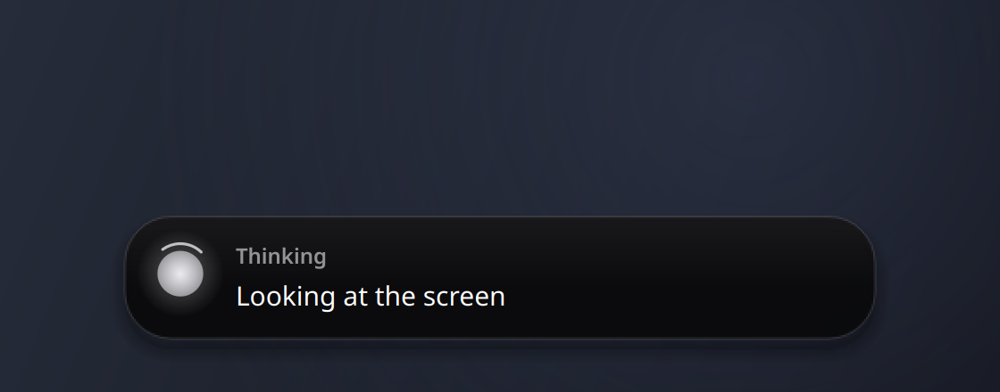
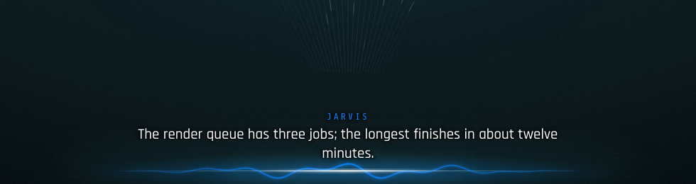

# Jarvis

A voice assistant for your Linux desktop that talks like J.A.R.V.I.S. from the Iron Man films. Say **"Hey Jarvis"**, wait for the chime, talk. The brain is a long-running Claude Code session (through the Claude Agent SDK), so it can do anything Claude Code can: run commands, edit files, search the web, drive Chrome. On top of that it gets its own desktop tools: open apps, focus windows, take screenshots, click, scroll, type, control media and volume, and draw on your screen to show you where things are. Longer jobs go to background workers so it stays free to talk.

How it fits together:

- `ears.py`: microphone, "Hey Jarvis" wake word (openWakeWord), end-of-speech detection, speech to text (faster-whisper).
- `brain.py`: one persistent Claude Code session, the persona, and the safety gate that asks you out loud before risky actions.
- `mouth.py`: text to speech (Kokoro by default, or a Piper voice), cut off the moment you talk over it.
- `pctools.py` + `kwin.py`: the desktop tools, served to Claude as an in-process MCP server called `jarvis`.
- `worker.py`: background workers, each its own Claude Code session.
- `jarvis.py`: the main loop. `dashboard.py` + `dashboard.html`: a local web dashboard. `widget.py`: the on-screen status line. `overlay.py`: draws rings, arrows and labels on screen. `design.py`: their shared look. `events.py`: the activity log.
- `jarvis-os/`: JARVIS OS, an optional full-screen dashboard that sits under your windows like a wallpaper (its own README).
- `persona.md`: the system prompt, a template filled in from your config. `lines.md`: real JARVIS lines by situation, used to tune the voice.

## Requirements

- Linux with **KDE Plasma 6 on Wayland**. Desktop control currently targets KWin only (window list, focus and cursor go through KWin scripts, input through ydotool). The voice and Claude parts would work elsewhere, the desktop tools would not.
- **Claude Code** installed and logged in (`claude`, then log in with your Claude subscription). Jarvis uses your normal Claude Code login, settings, memory and MCP servers.
- A microphone. Headphones are recommended if you want to interrupt it by talking over it.
- Python 3.12 (what it is tested on).
- System tools: `ydotool` (and write access to `/dev/uinput`, usually via a udev rule or the `input` group), `spectacle`, `qdbus`, `busctl`, `wpctl`, `pactl`, `notify-send`, `gtk-launch`, `xdg-open`, and PortAudio for `sounddevice`. Most are already there on a KDE desktop.
- For the widget and the on-screen drawing: the system Python's PySide6 and KDE's layer-shell-qt (on Fedora-based systems `python3-pyside6` and `layer-shell-qt`). Both run on `/usr/bin/python3`, because layer-shell needs the system Qt rather than the venv's.
- Optional: the Claude in Chrome extension, so it can work in your browser.

## Install

```
git clone <this repo> ~/jarvis
cd ~/jarvis
python3.12 -m venv .venv
.venv/bin/pip install -r requirements.txt

# Kokoro voice model
mkdir -p models
curl -L -o models/kokoro-v1.0.onnx https://github.com/thewh1teagle/kokoro-onnx/releases/download/model-files-v1.0/kokoro-v1.0.onnx
curl -L -o models/voices-v1.0.bin https://github.com/thewh1teagle/kokoro-onnx/releases/download/model-files-v1.0/voices-v1.0.bin

# "Hey Jarvis" wake word and voice detection models
.venv/bin/python -c "import openwakeword.utils as u; u.download_models(['hey_jarvis'])"
```

The whisper models download by themselves on first run.

## Configure

Settings live in `config.py`. Put your own values in `config_local.py` (it is gitignored and overrides `config.py`), for example:

```
USER_NAME = "Pepper"
HONORIFIC = "ma'am"
CITY = "Manchester"
WRITE_OK_DIRS = ["/home/pepper/projects"]
VOCAB = "Jarvis, Pepper, Manchester, Spotify, Discord, Konsole."
```

| Setting | What it does |
|---|---|
| `USER_NAME` | Your name, as Jarvis refers to you |
| `HONORIFIC` | How it addresses you: "sir", "ma'am", "boss" |
| `CITY` | City for the weather line in the morning greeting (wttr.in, use + for spaces) |
| `WRITE_OK_DIRS` | Folders outside your home it may write to without asking |
| `VOCAB` | Names and words whisper keeps mishearing |
| `VOICE` | Kokoro voice: bm_lewis, bm_george, bm_daniel, bm_fable |
| `VOICE_ENGINE` / `PIPER_MODEL` | Switch to your own Piper voice (see below) |
| `MODEL` / `EFFORT` | Claude model and effort level |
| `JUDGE_MODEL` | Cheaper model that approves routine worker steps |
| `POLITE` | Hold unprompted speech while you are on a call (`POLITE_*` tune it) |
| `WAKE_THRESHOLD` | Raise if it wakes on its own, lower if it ignores you |
| `END_SILENCE_S` | Raise if it cuts you off mid-sentence |
| `MIC_DEVICE` | None for the system default input |
| `WIDGET_SCREEN` | Which monitor the widget sits on |

Times in the greetings use your system clock and time zone.

## Run

```
.venv/bin/python jarvis.py
```

Or as a systemd user service (examples in `systemd/`, they assume the code lives in `~/jarvis`):

```
cp systemd/*.service ~/.config/systemd/user/
systemctl --user daemon-reload
systemctl --user enable --now jarvis jarvis-widget
journalctl --user -u jarvis -f       # watch what it hears and does
```

Restart after changing the config: `systemctl --user restart jarvis`.

Dashboard: **http://127.0.0.1:8765** (this PC only). It shows what Jarvis is doing, background jobs, history with every step, what it heard, and has Yes/No buttons and a box for typed commands.

## Controls

| Do | How |
|---|---|
| Talk | "Hey Jarvis", or `jarvisctl listen` |
| Interrupt / cancel | Talk over it, say "Hey Jarvis", or `jarvisctl stop` |
| Type instead of talk | `~/jarvis/jarvisctl say open spotify` |
| Answer a "Shall I...?" | Say yes or no, or `jarvisctl yes` / `jarvisctl no` |
| Voice test | `~/jarvis/jarvisctl speak hello` |
| Status | `~/jarvis/jarvisctl status` |
| Fresh session | Say "new session" |

Hotkeys: in System Settings > Keyboard > Shortcuts, add a new command shortcut for `jarvisctl listen` (say Meta+J) and one for `jarvisctl stop` (say Meta+Shift+J), using the full path to `jarvisctl`.

After you answer, it listens for 5 seconds so you can follow up without the wake word.

## Sessions and notes

Each conversation is a fresh Claude session. A new one starts after 30 minutes idle (`SESSION_IDLE_RESET_MIN`), or when you say "new session". Before a session closes it writes a running summary into `notes.md` (open threads, a dated log of what you asked, lessons about working with you), and the next session reads it first. `notes.md` is created on first use (see `notes.example.md`), stays out of git, and you can edit it by hand.

## Customising the persona

`persona.md` is the system prompt. `$USER_NAME`, `$HONORIFIC`, `$CITY` and `$LINES_FILE` are filled in from the config. Change anything you like. The speaking style is built from real JARVIS lines, collected by situation in `lines.md`. Every message gets a time tag (`[Mon 28 Sep, 07:42, first today]`), so it greets you on your first message of the day, says welcome back after a few hours away, and notices when it is past midnight.

## Widget

A thin glowing "emitter line" at the bottom centre of a monitor, on top of everything including fullscreen windows, click-through and never focused. No box, no blur: at rest it draws nothing. When something happens the line lights up, one colour per state, and the words float above it:

- **Listening**: white, rippling with your voice, your words live above it.
- **Thinking**: cyan, a spark sweeping to and fro, with the step it's on.
- **Speaking**: blue, rippling with Jarvis's voice, each sentence as it says it.
- **Waiting for yes/no**: orange, breathing. **Update ready** (held while you're on a call): green, breathing slower.
- **Jarvis not running**: a dim red line. Background work at rest: a faint spark drifting along the line.

It fades away a couple of seconds after Jarvis finishes. It looks best on a dark wallpaper with a line of its own at that spot: set `LINE_W` (length) and `LINE_UP` (pixels above the bottom edge) at the top of `widget.py` to sit exactly on it. The words use Rajdhani and Share Tech Mono if you have them installed (both free on Google Fonts), else your normal sans and monospace.

| Listening | Thinking |
|---|---|
|  |  |
| **Speaking** | **At rest** |
|  |  |

It runs as the `jarvis-widget` service, on the system `/usr/bin/python3` (KDE layer-shell needs the system Qt). Pick the monitor with `WIDGET_SCREEN`. Colours, fonts and motion live in `design.py`.

## JARVIS OS (optional dashboard)

A live dashboard for a second monitor that sits under every window like a wallpaper: Slack, Asana, today's calendar,
Jarvis and its workers, Steam, Twitch, Discord, time, weather, CPU/GPU and what's playing, around a day ring, with a
work mode and a game mode. Every feed is read-only and optional (missing credentials show sample data); Discord is off
by default. Setup is in [`jarvis-os/README.md`](jarvis-os/README.md).


## Show me where

Ask "where's the graphics setting?" or "how do I open the map?" and it takes a screenshot, then draws on your screen (rings, arrows, boxes, numbered steps; see `docs/overlay-preview.png`) while it talks you through it. It doesn't click unless you ask.

- Tools: `annotate` (shapes in the latest screenshot's pixels, same mapping as `click_at`) and `clear_annotations`.
- `overlay.py` is a KDE layer-shell surface, one per monitor, with an empty input region so clicks go straight through. Games that take the display directly (gamescope, VR) can't be drawn over.
- Try it: `/usr/bin/python3 overlay.py '{"duration": 5, "shapes": [{"type": "ring", "x": 960, "y": 540, "radius": 60, "label": "Here", "step": 1}]}'`

## Workers

For a job that takes more than a minute or so, or when you say "and also have Y going", Jarvis starts a **worker**: a separate Claude Code session in the background with a short name ("the video edit"), and stays free for you. Several can run at once.

- "What are the workers doing?", "tell the video one to use 2x", "stop the report": `list_workers` / `message_worker` / `stop_worker`.
- When one finishes, or needs you, Jarvis says so in a sentence.
- Permissions: a worker's risky steps go to a judge model (`JUDGE_MODEL`) first, which approves routine steps that fit the brief and passes the rest to you as a spoken question. Pressing Enter always comes to you.
- Take one over: ask Jarvis to stop it, then `claude --resume <session id>` in a terminal.

## Not talking over your calls

Things Jarvis says on its own (a worker finishing, a timer) wait while you're on a call and someone is talking: another app holding the mic (Discord, Zoom, Meet in a browser) counts as a call, and each call app's playback level shows when the other people are talking. The widget shows the update is ready meanwhile; "Hey Jarvis" hears it straight away. Settings: `POLITE`, `POLITE_QUIET_S`, `POLITE_CALL_LEVEL`, `POLITE_MAX_WAIT_S`.

## Safety gate

The gate is `policy` in `brain.py`. It runs as a PreToolUse hook, before Claude Code's own allow rules, so an "always allow" rule in your settings can't skip it.

- Allowed without asking: reading, searching, the desktop tools (except Enter), Chrome browsing and clicking, safe Bash, file edits inside your home folder and `WRITE_OK_DIRS`.
- Asks out loud first: deleting or moving files (including `/bin/rm`, `find -delete` and deletes inside scripts), sudo, systemctl, ssh/scp, git push, POST requests, writes to shell and Claude settings files, edits to the gate's own code and config, and pressing Enter (that is how most apps send).
- **One yes per request**: once you say yes, the rest of that request doesn't ask again. Questions are one short line and name the risky command ("Shall I restart the widget, which runs systemctl?").
- A yes only counts at the start of your answer, so a "yes" in the middle of something you said to someone else doesn't approve anything. No answer counts as no.
- Clicks are not gated, so the persona tells it to ask before clicking Send, Post, Buy or Delete. Clicking and typing refuse if another window took focus since the last screenshot, or the screenshot is over a minute old.

The command rules are pattern matching, not a sandbox. Read `policy` before you trust it with anything important, and add your own rules there.

## Voice

Kokoro works out of the box with British voices (`bm_lewis` is the default). If you want a closer JARVIS sound, you can train your own Piper voice (see the Piper project's training guide), then set `VOICE_ENGINE = "piper"` and `PIPER_MODEL` to the `.onnx` file with its `.onnx.json` next to it. No trained voice or film audio ships with this repo.

## Tests

```
.venv/bin/python test_gate.py        # which commands ask, the gate hook, the wrong-window guard
.venv/bin/python test_workers.py     # worker permission routing, one yes per request
.venv/bin/python test_polite.py      # call detection and holding speech during calls
.venv/bin/python test_annotate.py    # screenshot-to-desktop mapping for the overlay
.venv/bin/python test_time_tag.py    # the greeting time tags
.venv/bin/python test_voice.py "Good evening."   # writes logs/voice-kokoro.wav (and piper if set)
```

## Licence

MIT, see `LICENSE`.
