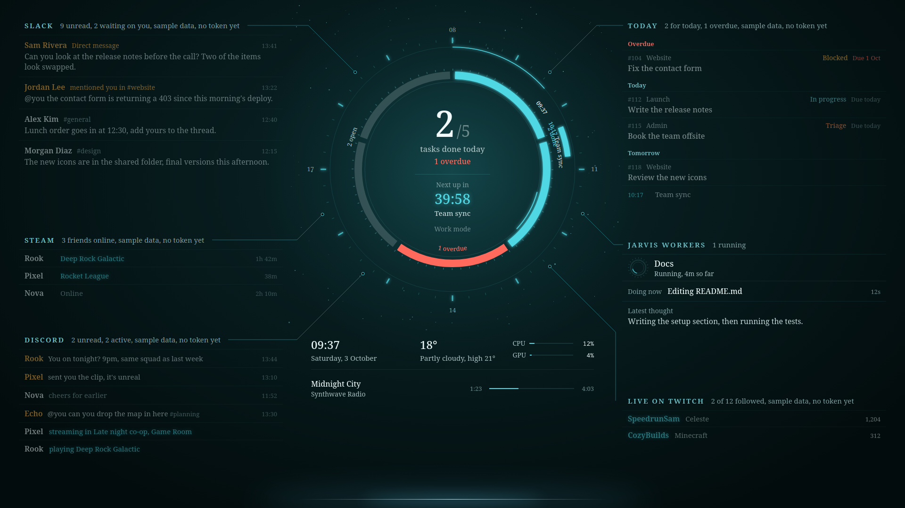
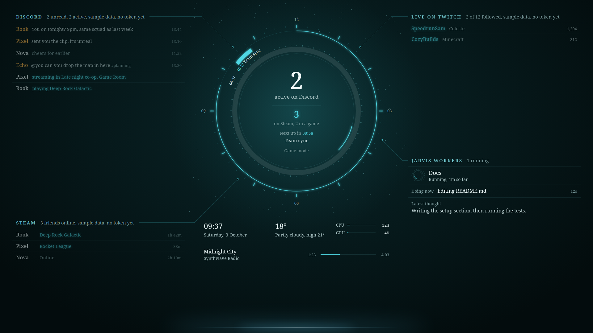

# JARVIS OS

A live dashboard that fills one 1920x1080 monitor and sits under every normal window, like a wallpaper: Slack, your
Asana tasks, today's calendar, Jarvis and its background workers, Steam, Twitch, Discord, the time, the weather, CPU/GPU
and what's playing, around a day ring. It has a work mode and a game mode.

| Work mode | Game mode |
|---|---|
|  |  |

(Screenshots show the built-in sample data and the fallback fonts.)

- `jarvis_os.py`: the window (the system Python's PySide6 Qt WebEngine, no extra packages) and every data feed.
- `index.html`: the page. Python pushes each feed into it with `feed(name, data)`.
- `kwin-rule.sh`: the KWin window rule that keeps it below everything, borderless, out of the taskbar, alt-tab and
  pager, never focused, pinned to one monitor.
- `jarvis-os.service`: systemd user service, starts with the graphical session, restarts on failure.
- `mode`: switches between work and game mode (below).
- `test_feeds.py`: self-check for the parsing, the task grouping, link handling, the workers panel, the work/game
  schedule and the time zones. `python3 test_feeds.py` prints `ok`.

Every feed is read-only. Every credential is optional: a feed without one shows faded sample data, marked in its header.

The bottom-centre strip (x 630 to 1290, y 930 to 1080) stays empty on purpose: the Jarvis voice widget draws its line
and words there, on top of this window, and the page draws the widget's resting line so the two meet exactly.

## Requirements

- KDE Plasma 6 on Wayland (the window rule and the "bring the app forward" trick use KWin).
- A 1920x1080 monitor for it to fill (the layout is fixed at that size).
- The system Python with PySide6 and Qt WebEngine (on Fedora-based systems `python3-pyside6`).
- Optional: `nvidia-smi` for the GPU bar; any MPRIS player for "now playing"; Jarvis itself for the workers panel
  (it reads `http://127.0.0.1:8765/api/snapshot`).
- Fonts: Barlow, Barlow Condensed and JetBrains Mono (all free on Google Fonts). Install them system-wide, or put the
  woff2 files and a `fonts.css` with their `@font-face` rules in `jarvis-os/fonts/` (that folder is gitignored). Without
  them it falls back to your default fonts, as in the screenshots.

## Install

From the Jarvis checkout (`~/jarvis`):

    mkdir -p ~/.config/systemd/user
    cp jarvis-os/jarvis-os.service ~/.config/systemd/user/
    systemctl --user daemon-reload
    systemctl --user enable --now jarvis-os
    jarvis-os/kwin-rule.sh 0,0        # X,Y = the top-left corner of the monitor it should fill

If you cloned somewhere other than `~/jarvis`, fix the two paths in `jarvis-os.service` first.

## Run, stop, remove

    systemctl --user status jarvis-os
    systemctl --user restart jarvis-os        # after editing index.html or jarvis_os.py, or adding a credential
    journalctl --user -u jarvis-os -f         # log: feed failures and every link opened
    systemctl --user disable --now jarvis-os
    jarvis-os/kwin-rule.sh remove             # takes out only its own rule; your other KWin rules stay

## Work and game mode

    jarvis-os/mode game    # Discord, Steam, Twitch, workers; no Slack, Asana or calls
    jarvis-os/mode work    # everything
    jarvis-os/mode auto    # back to the schedule

The running dashboard picks the change up within a second. The schedule is work mode Monday to Friday 09:00 to 19:00
and game mode the rest of the time (`WORK_HOURS`, in `SCHEDULE_TZ`, both at the top of `jarvis_os.py`; the zone
defaults to the PC's own). A manual `game` or `work` holds until the next scheduled switch. The state is one line in
`~/.config/jarvis-os/mode`; deleting it is the same as `auto`. Jarvis can run these commands when you say "game mode".

Game mode hides Slack, Today and the calls and stops fetching Asana and Slack. Discord moves to the top left, Steam
below it, Twitch to the top right, and the ring becomes a 12-hour clock with how many people are active on Discord and
online on Steam, plus your next calendar event.

Every time shown follows the mode's zone, `MODE_TZ` in `jarvis_os.py` (both modes default to the PC's zone; set one to
another zone if, say, you play with friends in a different country).

## Credentials (all optional, one file each in ~/.config/jarvis-os)

Create each file, then `chmod 600 ~/.config/jarvis-os/*` and restart. These files never go in the repo.

- `asana-token`: an Asana personal access token (Asana, My settings, Apps, Developer apps). The dashboard only ever
  GETs. `asana-workspace` (optional): the workspace gid; without it, your first workspace. Today shows your incomplete
  tasks grouped by due date (Overdue, Today, Tomorrow, the weekday, then dates, then No due date), with a "[#123]"
  prefix shown as the task ref, the first project as the client, and a "Status" custom field if you have one.
- `calendar-ics-url`: a calendar's secret iCal address (Google Calendar: Settings, your calendar, "Secret address in
  iCal format"). Daily and weekly repeats are understood; monthly ones are skipped.
- `slack-token`: a Slack **user** token (`xoxp-...`) from a Slack app of your own with user scopes `channels:read
  groups:read im:read mpim:read channels:history groups:history im:history mpim:history users:read`. Read scopes only,
  so it cannot post even by mistake, and the code refuses any method but its five reads. `slack-channels`: the channel
  names to show, one per line. Your three newest DMs always show.
- `steam-key`: a Steam Web API key from https://steamcommunity.com/dev/apikey. Your SteamID is read from Steam's own
  `loginusers.vdf`. `steam-favourites` (optional): steamids pinned at the top, shown even offline, one per line.
- `twitch.env`: `TWITCH_ACCESS_TOKEN=` a user token with `user:read:follows` and `TWITCH_CLIENT_ID=` its app's client
  id. Shows the channels you follow that are live. `twitch-extra` (optional): more logins to watch, one per line.
- `weather-location`: a city (`Berlin`, `New+York`) or `lat,lon` for wttr.in. Without it wttr.in guesses from your IP.
  The place name is never shown.

### Discord (off by default)

With no Discord file the panel shows sample data and makes no Discord connection at all. That is the recommended
setting.

Discord has no API for a user's own DMs and friends, so the only way to fill this panel with your DMs, mentions, who is
in voice and which friends are playing is to connect with **your own user token**. That makes the dashboard a
**self-bot, which is against Discord's Terms of Service, and Discord can ban the account**. Only do it if you accept that
risk. The panel is built to keep it low:

- It only listens. The only frames it sends are the gateway handshake, heartbeats, and a "subscribe" for the servers
  you list (the same one the official client sends when you open a server). It never sends a message, reaction, typing
  indicator or status, never joins anything, and makes no REST write.
- At startup it reads the last message of your five most recent DMs, a couple of seconds apart, for their previews;
  after that everything comes from gateway events, with no polling.
- It connects as invisible, so it never shows you as online.
- Reconnects back off exponentially (at most about three tries an hour), and it stops for good if the token is
  rejected.

If you accept the risk: put the token in `discord-user-token`, your own user id in `discord-user-id` (Developer Mode
on, right-click your name, Copy User ID; used to spot mentions of you), and optionally the servers whose voice
channels should show in `discord-voice-servers`, one name per line (without it, every server's voice shows).
Never share the token: it is full access to your account. To turn it off again, delete `discord-user-token` and restart.

## Clicking

Every link goes through `link_cmd()` in `jarvis_os.py`: web pages and `slack://`, `discord://`, `steam://` links open
through `xdg-open` (the desktop app is brought forward); any other scheme is refused. The workers panel opens the
Jarvis dashboard.

## Cost

About 5% of one CPU core at idle and about 200 MB of RAM. The spinners step four times a second on their own layers;
smooth SVG animation cost far more, so keep `<animateTransform>` out.

## Known limits

- The layout is fixed at 1920x1080.
- The day ring covers 08:00 to 20:00 in work mode (`DAY_START` in index.html); only today's calendar events are fetched.
- Discord DM and mention times are hours and minutes only, with no day.
- Steam durations count from when the dashboard first saw that friend in that game; Steam chat isn't available.
- Slack makes two API calls per conversation every 3 minutes; fine for about 100 conversations.
